# TokTickIT — Lab 2 Submission

**Project:** TokTickIT — Requester Ticketing MVP with UI Foundation
**Sprint:** Lab 2
**Author:** Tanakrit (67070503464)
**Reviewer:** Richyboy170
**Repository:** https://github.com/Tanakrit-triton/toktickit
**Released to `main`:** [#29](https://github.com/Tanakrit-triton/toktickit/pull/29), merged as `09ee647`

> **A note on Parts 2, 4, 5, 6 and 9.** The labsheet headings for these were not
> given to me verbatim, so their content is taken from the Definition of Done in
> `specification.md` section 10 and from what each part is evidently for. If a
> heading below asks for something other than the labsheet intends, the material
> is present in the repository and only its placement needs moving.

---

## Answer Part 1

**Repository:** https://github.com/Tanakrit-triton/toktickit

### Commit history on final `main`

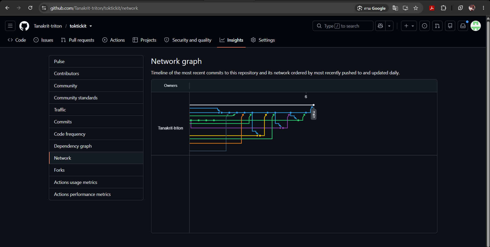

`artifacts/lab-02/screenshots/process/desktop-branch-network.png`

GitHub's network graph, showing each feature branch diverging from and merging
back into the integration line, and that line merging once into `main`.

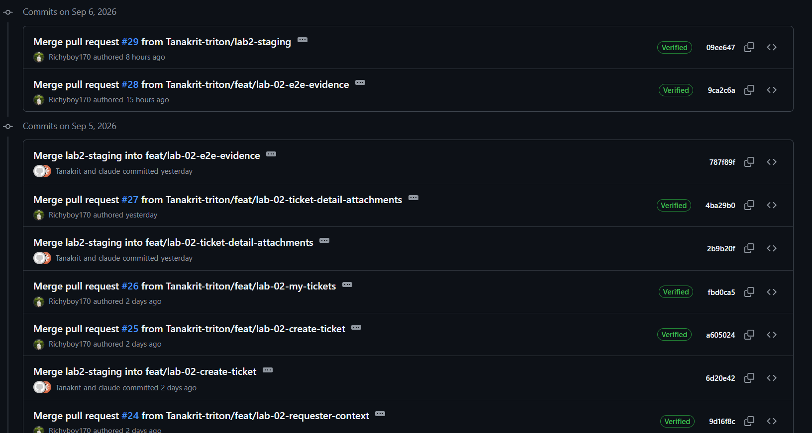

`artifacts/lab-02/screenshots/process/desktop-main-history-upper.png`

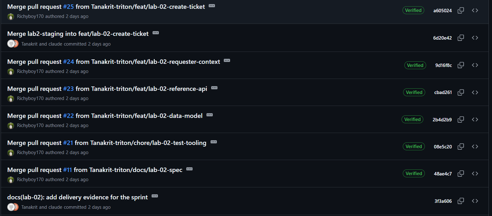

`artifacts/lab-02/screenshots/process/desktop-main-history-lower.png`

The commit history of the final `main` branch, in two portions: the release
merge #29 down through #24, and #25 down to the specification merge #11. The
pattern is the same throughout — a feature branch merges into `lab2-staging`,
and `lab2-staging` merges once into `main`.

**Every merge commit is authored by Richyboy170, and each is Verified.** That is
direct proof of the first course rule: the reviewer merges, not the author. It
is a stronger claim than an approval, because an approval can precede a
self-merge, whereas the author of the merge commit is a fact recorded in the
object itself and cannot be edited after the fact.

Verifiable without the screenshots:

```bash
git log origin/main --merges --pretty=format:"%h %an | %s" | grep "lab-02"
```

which returns, for all ten:

```
09ee647 Patiharn Liangkobkit | Merge pull request #29 from Tanakrit-triton/lab2-staging
9ca2c6a Patiharn Liangkobkit | Merge pull request #28 from Tanakrit-triton/feat/lab-02-e2e-evidence
4ba29b0 Patiharn Liangkobkit | Merge pull request #27 from Tanakrit-triton/feat/lab-02-ticket-detail-attachments
fbd0ca5 Patiharn Liangkobkit | Merge pull request #26 from Tanakrit-triton/feat/lab-02-my-tickets
a605024 Patiharn Liangkobkit | Merge pull request #25 from Tanakrit-triton/feat/lab-02-create-ticket
9d16f8c Patiharn Liangkobkit | Merge pull request #24 from Tanakrit-triton/feat/lab-02-requester-context
cbad261 Patiharn Liangkobkit | Merge pull request #23 from Tanakrit-triton/feat/lab-02-reference-api
2b4d2b9 Patiharn Liangkobkit | Merge pull request #22 from Tanakrit-triton/feat/lab-02-data-model
08e5c20 Patiharn Liangkobkit | Merge pull request #21 from Tanakrit-triton/chore/lab-02-test-tooling
48ae4c7 Patiharn Liangkobkit | Merge pull request #11 from Tanakrit-triton/docs/lab-02-spec
```

Patiharn Liangkobkit is the account behind the handle Richyboy170. The Lab 1
release merge `99efd2d` is authored by Tanakrit-triton, which is the contrast:
that sprint predates the rule.

| Merge | Branch | PR |
|---|---|---|
| `09ee647` | `lab2-staging` into `main` | [#29](https://github.com/Tanakrit-triton/toktickit/pull/29) |
| `9ca2c6a` | `feat/lab-02-e2e-evidence` | [#28](https://github.com/Tanakrit-triton/toktickit/pull/28) |
| `4ba29b0` | `feat/lab-02-ticket-detail-attachments` | [#27](https://github.com/Tanakrit-triton/toktickit/pull/27) |
| `fbd0ca5` | `feat/lab-02-my-tickets` | [#26](https://github.com/Tanakrit-triton/toktickit/pull/26) |
| `a605024` | `feat/lab-02-create-ticket` | [#25](https://github.com/Tanakrit-triton/toktickit/pull/25) |
| `9d16f8c` | `feat/lab-02-requester-context` | [#24](https://github.com/Tanakrit-triton/toktickit/pull/24) |
| `cbad261` | `feat/lab-02-reference-api` | [#23](https://github.com/Tanakrit-triton/toktickit/pull/23) |
| `2b4d2b9` | `feat/lab-02-data-model` | [#22](https://github.com/Tanakrit-triton/toktickit/pull/22) |
| `08e5c20` | `chore/lab-02-test-tooling` | [#21](https://github.com/Tanakrit-triton/toktickit/pull/21) |
| `48ae4c7` | `docs/lab-02-spec` | [#11](https://github.com/Tanakrit-triton/toktickit/pull/11) |

### Pull requests, all merged and approved

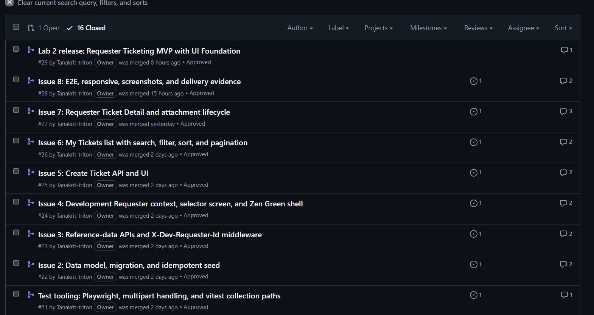

`artifacts/lab-02/screenshots/process/desktop-pull-requests-merged.png`

All ten Pull Requests, merged, each showing **Approved** and its linked Issue.
This is supporting evidence for the same rule: the approvals are visible here,
and the merge authorship above shows who acted on them.

### Issues and the Kanban board

Nine issues, one branch and one Pull Request each.

| Issue | Title |
|---|---|
| [#12](https://github.com/Tanakrit-triton/toktickit/issues/12) | Lab 2 sprint specification and test plan |
| [#20](https://github.com/Tanakrit-triton/toktickit/issues/20) | Test tooling: Playwright, multipart handling, vitest collection paths |
| [#13](https://github.com/Tanakrit-triton/toktickit/issues/13) | Data model, migration, and idempotent seed |
| [#14](https://github.com/Tanakrit-triton/toktickit/issues/14) | Reference-data APIs and the X-Dev-Requester-Id middleware |
| [#15](https://github.com/Tanakrit-triton/toktickit/issues/15) | Development Requester context, selector screen, Zen Green shell |
| [#16](https://github.com/Tanakrit-triton/toktickit/issues/16) | Create Ticket API and UI |
| [#17](https://github.com/Tanakrit-triton/toktickit/issues/17) | My Tickets list with search, filter, sort, pagination |
| [#18](https://github.com/Tanakrit-triton/toktickit/issues/18) | Requester Ticket Detail and attachment lifecycle |
| [#19](https://github.com/Tanakrit-triton/toktickit/issues/19) | E2E, responsive, screenshots, and delivery evidence |

**Board:** https://github.com/users/Tanakrit-triton/projects/2

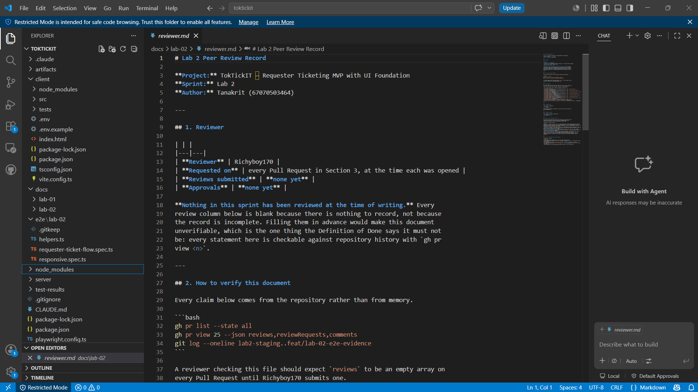

`artifacts/lab-02/screenshots/project-board/desktop-kanban-done.png`

**Done 13** — the nine Lab 2 cards and the four carried from Lab 1. Started, PR
Review and Fixing are all empty, so no work is left in flight. Each card shows
its issue number and the Pull Request that delivered it: #16 with #25, #17 with
#26, #18 with #27, #19 with #28.

Issue state and board position are separate things in GitHub Projects: closing
an issue does not move its card, and a card in Done does not close its issue.
Both are true here, and the screenshot is the evidence for the second, since the
board column is not derivable from the issue list.

### Repository structure

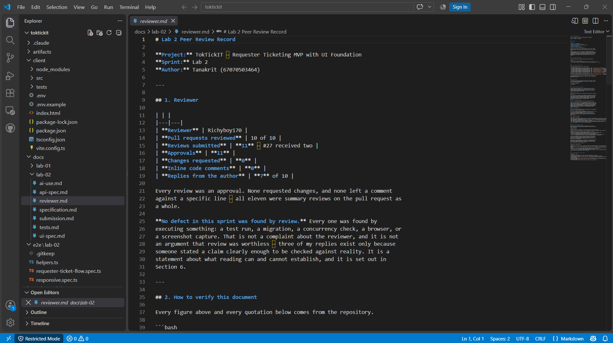

`artifacts/lab-02/screenshots/process/desktop-repository-structure.png`

The working tree: `client/` and `server/` hold the application, `docs/lab-02/`
the four specification documents plus this submission, `e2e/lab-02/` the
Playwright suites, `artifacts/` the captured evidence, and `CLAUDE.md` the
course workflow rules that applied to every session. `node_modules/` and
`test-results/` appear in the editor because they exist on disk; both are
ignored and neither is tracked.

### Peer review record

**Rendered:** [docs/lab-02/reviewer.md](https://github.com/Tanakrit-triton/toktickit/blob/docs/lab-02-submission/docs/lab-02/reviewer.md)

Ten Pull Requests reviewed, **eleven reviews** — #27 received two — every one
an approval, with no changes requested and no inline comments. Seven drew a
reply from me. **Three of those replies corrected the review**: the purity
claim on #22, the transaction claim on #25, and the mobile-cards claim on #26.
Those exchanges are section 5 of that document and are the substantive part of
the record.

Section 6 records something the sprint is worth being honest about: **no defect
was found by review**. Every one was found by executing something — a test run,
a migration, a concurrency check, a browser, a screenshot capture.

### This submission is itself awaiting review

The document you are reading, together with the corrected `reviewer.md` and the
trimmed `ai-use.md`, lives on `docs/lab-02-submission` and is open as a Pull
Request awaiting Richyboy170. It is not on `main` yet, and it is not merged.

Every link in this document therefore points at
`blob/docs/lab-02-submission/` rather than `blob/main/`, so a marker following
one today sees the corrected document rather than the superseded copy still on
`main`.

**This is deliberate, and it is the same rule the rest of Part 1 is evidence
for.** The submission could be merged by its author in a moment. Doing so would
contradict the claim made three sections above — that every merge commit on
`main` is authored by the reviewer — using the submission document itself as the
counter-example. A record that documents a rule and then breaks it to publish
itself is worth less than one that waits.

**Pull Request:** [#32](https://github.com/Tanakrit-triton/toktickit/pull/32)

One other Pull Request is open and unmerged: [#31](https://github.com/Tanakrit-triton/toktickit/pull/31),
which fixes the end-to-end base URL default described in Part 3.

### README and .gitignore

**Rendered:** [README.md](https://github.com/Tanakrit-triton/toktickit/blob/docs/lab-02-submission/README.md) and [.gitignore](https://github.com/Tanakrit-triton/toktickit/blob/docs/lab-02-submission/.gitignore)

The README setup, run, seed and test instructions were executed from a clean
checkout, not written from memory. `.gitignore` keeps attachment binaries and
generated Playwright output out of the repository while keeping the screenshots
under `artifacts/lab-02/screenshots/` tracked, because Part 1 of the Definition
of Done requires them as evidence.

---

## Answer Part 2

**Rendered specification:** [docs/lab-02/specification.md](https://github.com/Tanakrit-triton/toktickit/blob/docs/lab-02-submission/docs/lab-02/specification.md)

The document is numbered throughout, so each item can be cited from a test or a
commit message:

| Section | Contents | Count |
|---|---|---|
| §4 Functional Requirements | FR-01 … FR-35 | 35 |
| §5 Business Rules | BR-01 … BR-49 | 49 |
| §9 Acceptance Criteria | AC-01 … AC-44 | 44 |
| §10 Definition of Done | Part 1 product completion, Part 2 course delivery | 2 parts |

§11 additionally records the two SDS deviations (DEV-01, DEV-02), the sprint
decisions (DEC-01 … DEC-08), the assumptions (A-01 … A-06), and the one
amendment to an approved rule (AMD-01).

### The specification existed before implementation

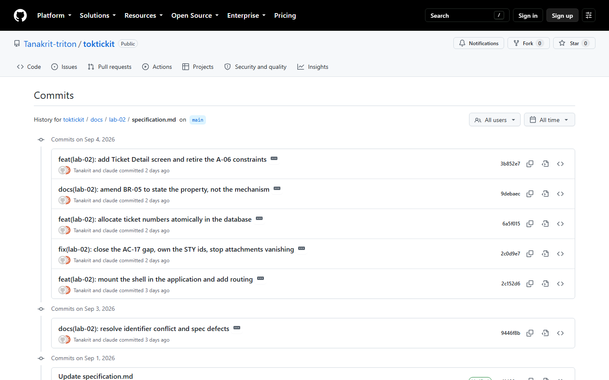

`artifacts/lab-02/screenshots/process/desktop-spec-precedes-implementation.png`

The file history of `specification.md` on `main`, which carries absolute dates
rather than the relative ones the pull request list shows. The earliest commit
is **1 September 2026**. The implementation pull requests merged from
**5 September** onwards:

| Pull request | Merged |
|---|---|
| [#11](https://github.com/Tanakrit-triton/toktickit/pull/11) specification | 2026-09-05T00:07:24Z |
| [#22](https://github.com/Tanakrit-triton/toktickit/pull/22) data model | 2026-09-05T00:13:08Z |
| [#25](https://github.com/Tanakrit-triton/toktickit/pull/25) Create Ticket | 2026-09-05T04:24:55Z |
| [#27](https://github.com/Tanakrit-triton/toktickit/pull/27) Ticket Detail | 2026-09-05T15:42:17Z |
| [#28](https://github.com/Tanakrit-triton/toktickit/pull/28) E2E and evidence | 2026-09-06T05:52:08Z |

The specification was authored, reviewed and merged before any implementation
pull request completed. Every document carried the status line *"Draft for
approval — must be merged before implementation PRs begin"* until #11 merged.

**One honest qualification.** The specification did not survive contact with the
code unchanged. Three rules in it proved unsatisfiable as written and were
corrected during the sprint — BR-05 (amended as AMD-01), DEC-04, and the
Unavailable attachment state in `ui-spec.md` §5.5. Each was found by attempting
the implementation rather than by review. This is set out in Part 4, because it
is the most useful thing the sprint produced.

---

## Answer Part 3

**Test results**, run on final `main`. The server and client commands are the
documented README commands verbatim; the end-to-end command needed one
override, for the reason set out below.

| Suite | Command | Tests | Passed | Failed |
|---|---|---|---|---|
| Unit + API | `cd server && npm test` | 92 | 92 | 0 |
| UI component + style | `cd client && npm test` | 76 | 76 | 0 |
| Responsive + E2E | `npm run test:e2e` | 24 | 24 | 0 |
| **Total** | | **192** | **192** | **0** |

**These figures match `tests.md` section 6 exactly.** Nothing was adjusted to
make them agree.

Captured output: [server-tests.txt](../../artifacts/lab-02/evidence/server-tests.txt), [client-tests.txt](../../artifacts/lab-02/evidence/client-tests.txt), [e2e-tests.txt](../../artifacts/lab-02/evidence/e2e-tests.txt)

**18 Playwright skips, none of them a disabled test.** Each is a spec declining
to run at a viewport where it does not apply: E2E journeys run at one width
(10), RSP-06 applies to mobile only (2), and `ui-spec.md` section 10 lists three
screenshot paths at desktop only (6).


### One defect found while running these

**`npm run test:e2e` as documented fails on a clean setup.** The README says the
UI runs on `http://localhost:5173`, and `playwright.config.ts` defaults its
`baseURL` to 5173 — but `e2e/lab-02/helpers.ts` defaults `BASE` to **5174**:

```
e2e/lab-02/helpers.ts:6   export const BASE = process.env.E2E_BASE_URL ?? "http://localhost:5174";
playwright.config.ts:20   baseURL: process.env.E2E_BASE_URL ?? "http://localhost:5173",
```

Run against a UI on the documented port, every specification fails with
`net::ERR_CONNECTION_REFUSED at http://localhost:5174`. The 5174 default was
baked in during development because that is where Vite happened to be listening
at the time, and the mismatch was never exercised because every later run passed
`E2E_BASE_URL` explicitly.

The figures above were obtained with `E2E_BASE_URL=http://localhost:5173
npm run test:e2e`, which the README does document as the override for a UI on a
different port — but 5173 is the documented default, so no override should be
needed.

**This is reported rather than fixed**, because it is a defect in code already
merged to `main` and correcting it belongs in its own change with its own
review, not in the submission document. `tests.md` §6 is unchanged: its figures
were correct and remain correct.

---

## Answer Part 4

**Rendered AI use document:** [docs/lab-02/ai-use.md](https://github.com/Tanakrit-triton/toktickit/blob/docs/lab-02-submission/docs/lab-02/ai-use.md)

### LLM used

**Claude Opus 5** (model id `claude-opus-5`), through **Claude Code** in the
Claude desktop application, with tool access to the working tree, a shell, and
the `gh` CLI. That access is why the prompt table records outcomes rather than
suggestions: most prompts ended in a command actually run against the real
database and its real output. No other model or AI service was used.

### Key prompts

`ai-use.md` §2 tabulates **ten** prompts, quoted from the session and abridged
only where long. Each row gives the prompt, what it was for, and what came back.
They span the opening audit, the specification defect fixes, the `428`
correction, Issue #13's false premise, the blocked dependency on Issue #15, and
Issues #16 through #19.

### My Reflection

`ai-use.md` §5. The substance, in short:

The most useful thing the model did was not writing code. It was reading four
documents against each other and finding that two contradicted each other on
primary keys — a conflict that had survived being written, committed, and
pushed to an open pull request.

The pattern held: the model was most valuable asked to **check** something
against a written contract, and least trustworthy asked to **assert** that
something worked. Every defect it found was found by comparison — specification
against specification, generated SQL against the real state of the table, a
green test run against what parallel execution actually does.

It produced defects of the same kind in its own work. Three tests in #18 passed
before the feature existed, because they asserted only that something was
absent and an empty response satisfies that. Two tests in #16 passed or failed
by machine load. A regex built by string concatenation lost its escape and
would have accepted a malformed ticket number.

§4 records the finding I consider most important. **Three rules from documents I
wrote, reviewed and approved before any code existed described things the system
could not do:**

| Rule | Why it could not hold |
|---|---|
| **BR-05** | Implemented exactly, and duplicates were still reachable. Eight parallel creations failed six times. The rule named a mechanism and assumed a guarantee that mechanism does not deliver. Amended as AMD-01. |
| **DEC-04** | Contradicted `api-spec.md` §1.2 on primary keys, on the same pull request, neither flagging it. Following it meant a destructive migration of Lab 1 data. |
| **ui-spec §5.5** | An attachment state shown "when an upload failed after the Ticket was created". A failed upload persists nothing, so a reloaded screen has nothing to render it from. |

Each reads as correct, cites the right identifiers, and sounds like what an
experienced engineer would write. Reviewing prose against prose cannot separate
a rule that is correct from one that is merely plausible. The lesson I take is
narrow: **a rule naming a mechanism is weaker than one stating a property**,
because the mechanism can be implemented faithfully while the property it was
chosen for goes unmet. BR-05 now states the property and names the test that
proves it.

---

## Answer Part 5

**The simulated login screen — selecting the session Requester.** Zero points;
graded within Part 6.

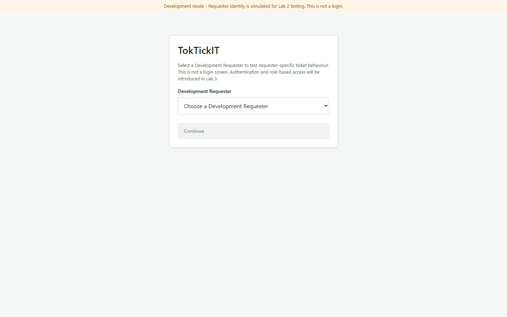

`artifacts/lab-02/screenshots/requester-selection/desktop-loaded.png`

The dropdown is expanded in this capture. A closed native select renders its
popup through the operating system, so a screenshot of the closed control shows
only the placeholder and proves nothing about which Requesters are listed. Only
the control's presentation is changed; the options are the application's own,
fetched from `GET /api/v1/dev-requesters`.

**Four active Requesters are listed** — Napat Chaiwong, Pimchanok Sonthi,
Siriporn Meesuk, Thanawat Rattana. **The seeded inactive Requester, Kittipong
Wong, is absent**, which is AC-01 and BR-10: inactive Requesters are filtered
server-side and never reach the client at all.

**This is not authentication, and the screen says so.** The explanatory text
reads *"This is not a login screen. Authentication and role-based access will be
introduced in Lab 3."*, and the notice above it appears on every screen in the
application. The selection is unsigned, held in session storage, and sent as the
`X-Dev-Requester-Id` header; it carries no cryptographic guarantee and no part
of the implementation treats it as proof of identity (BR-03, BR-11). DEC-02
keeps identity in a header rather than the URL or body, so the Lab 3 migration
to a session cookie changes no route signature.

The remaining states of this screen — loading, empty, failure — and the
selected-user display and Change Requester action are answered in Part 6.

---

## Answer Part 6

All captures are 1440x900 unless stated. Each was produced by a script that
asserts its subject is painted and inside the viewport before the file is
written, so an image showing a loading skeleton, a blank render, or a subject
below the fold cannot be produced.

### Q1 — the Requester field comes from the pre-entry selection, and the saved Ticket carries the matching requesterId

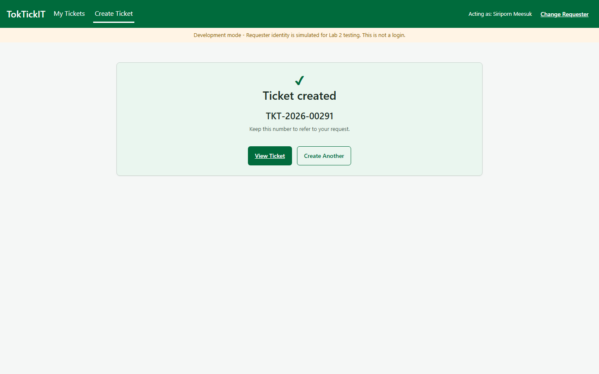

`artifacts/lab-02/screenshots/create-ticket/desktop-requester-ownership.png`

Siriporn Meesuk was chosen on the selector screen **before entering the
application**. The read-only Requester field on Create Ticket showed
`Siriporn Meesuk`, and the backend returned `TKT-2026-00291`.

The stored row, queried back out of PostgreSQL by that number
(`artifacts/lab-02/evidence/part-6-database-proof.txt`):

```
ticketNumber      TKT-2026-00291
requesterId       30147b1b-4294-4293-988b-ecb614b31759
requester         Siriporn Meesuk
currentStatus     NEW
createdAt         2026-09-06T19:35:31.589Z

requesterId matches the selected Requester: true
status is NEW on creation (BR-02):          true
Ticket Number matches TKT-YYYY-NNNNN:       true
```

**Neither value is chosen by the client.** No `requesterId` and no
`ticketNumber` appears in the create request body. Ownership is taken from the
`X-Dev-Requester-Id` header on the server, and a client-supplied `requesterId`
is ignored outright rather than consistency-checked, because checking it would
invite clients to send it (BR-08). The number is allocated by the backend inside
the same transaction as the insert, using an atomic database increment (BR-05,
AMD-01). API-02 asserts the stored `requesterId` matches the header, API-06
asserts a body value is ignored, and API-41 proves eight concurrent creations
all receive distinct numbers.

### Q2 — Create Ticket at desktop viewport, reference data loaded from the database

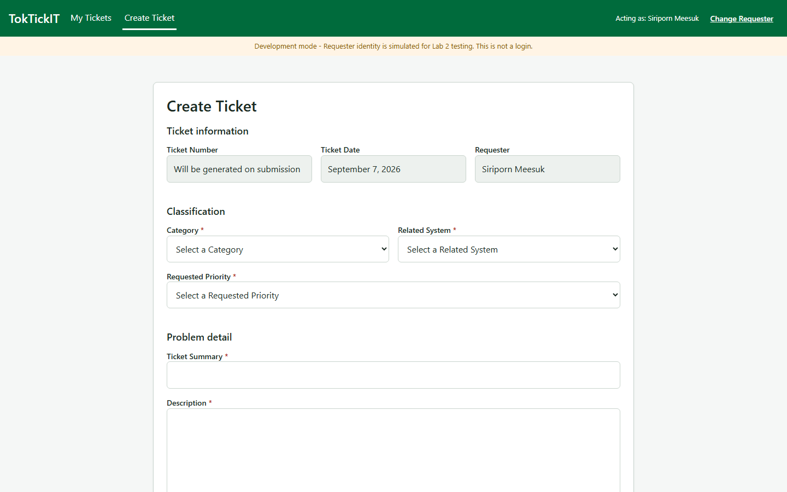

`artifacts/lab-02/screenshots/create-ticket/desktop-initial.png`

The system-generated group is populated and read-only: Ticket Number reads
*"Will be generated on submission"*, Ticket Date is today, and Requester is the
selected identity. Category and Related System come from
`GET /api/v1/categories` and `GET /api/v1/related-systems`, both of which return
active rows only, sorted by name.

**No option is hard-coded.** UI-10 asserts the rendered option list matches the
API response **exactly, count included**, so a component carrying a fallback
array alongside the API call fails rather than passing on a superset. API-38 and
API-39 assert the endpoints return active rows only and that an inactive record
never appears.

### Q3 — an invalid submission showing field-level messages

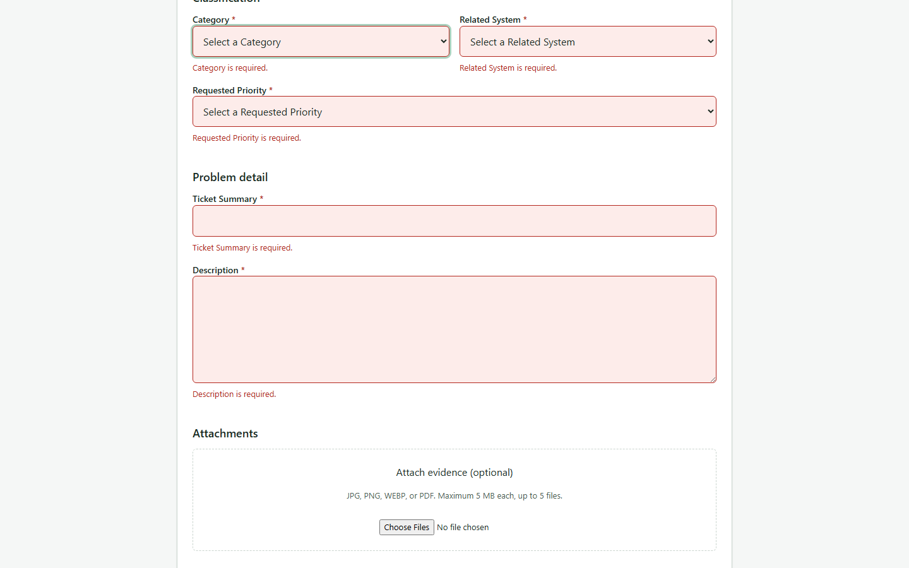

`artifacts/lab-02/screenshots/create-ticket/desktop-validation-failure.png`

Submitting the empty form reports **all five failing fields at once**, each
message directly below the control that failed, each field tinted with the
invalid state. No request is sent (AC-12).

Placement is asserted, not just presence: STY-02 requires the message to be the
**next sibling** of its own field and the field's `aria-describedby` target, so a
single summary block at the top of the form — which `ui-spec.md` §2.1 forbids —
would fail. The capture also asserts `document.activeElement` is the first
failing field, so it cannot be produced unless focus really moved there.

The server enforces the same rules independently and returns every failing field
in one `422` (BR-26, API-05). Client validation exists to make the feedback
immediate; it never replaces the server, and a `422` replaces the client's
messages with the server's per field (BR-24).

### Q4 — one valid and one invalid attachment selected, with the result explained

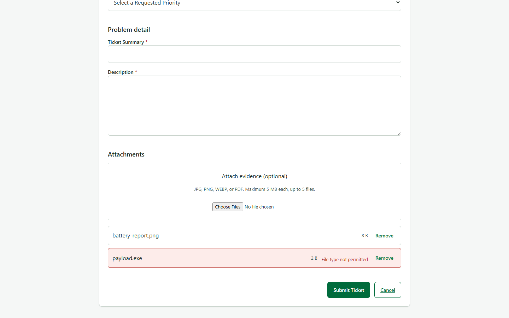

`artifacts/lab-02/screenshots/create-ticket/desktop-invalid-attachment.png`

Two files were selected in one action: `battery-report.png` and `payload.exe`.

**What happened, and why.** `battery-report.png` was **accepted**. Its extension
`.png` and its declared MIME type `image/png` are both permitted and they agree,
and it is under 5 MB, so it appears as an ordinary selected row with its size and
a Remove control, and it will be uploaded when the ticket is submitted.

`payload.exe` was **rejected**, and the row states why: **"File type not
permitted"**. Neither its extension nor its declared type
`application/x-msdownload` is among the four permitted combinations — JPG/JPEG,
PNG, WEBP, PDF (BR-30). **The rejected file remains visible rather than being
discarded silently**, which is the behaviour `ui-spec.md` §5.3 requires: a file
that vanished without explanation would leave the Requester believing evidence
had been attached. It is excluded from submission and occupies no slot against
the five-file limit.

Both halves of the type check must pass **and agree**. A `.pdf` announced as an
image is rejected too (UT-10), because either half alone would let a mislabelled
file through. Size is checked separately: over 5 MB is rejected with "File
exceeds 5 MB" (UT-11, API-26).

Writing this test found a real defect. The file input originally carried
`accept=".jpg,.jpeg,.png,.webp,.pdf"`, which made the browser hide impermissible
files from the picker — so the "File type not permitted" state `ui-spec.md` §5.3
specifies was **unreachable**. The filter was removed so that validation is the
single gate and the specified state can actually occur.

The server enforces the same policy independently, so a client that skipped the
check is refused: `415` for an impermissible or disagreeing type, `413` over
5 MB, `409` at the sixth active attachment (API-25, API-26, API-27).

### Q5 — backend stopped, showing the safe error state with form values preserved

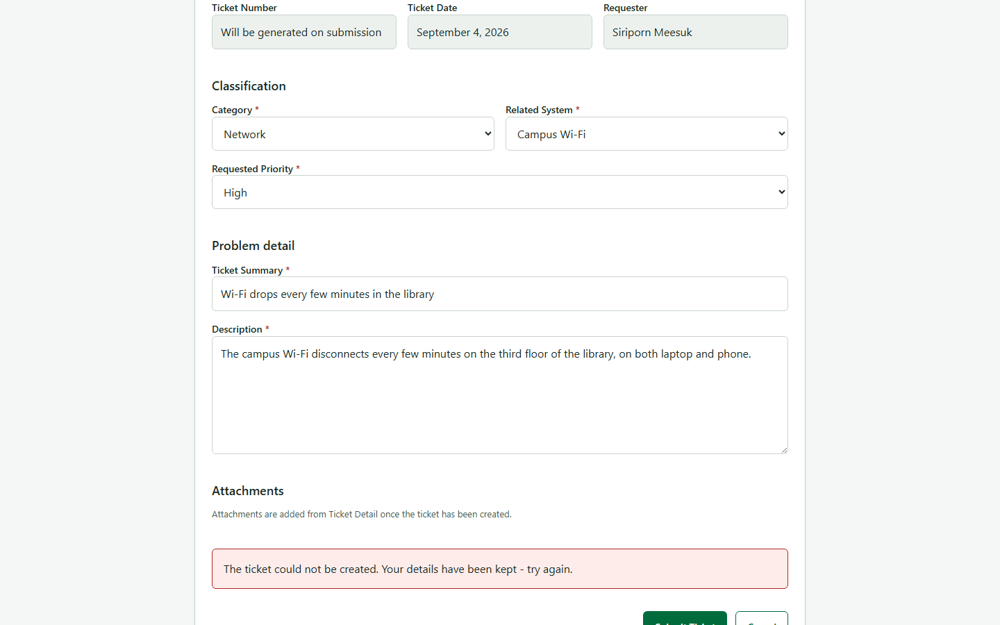

`artifacts/lab-02/screenshots/create-ticket/desktop-api-failure.png`

The form was filled, the API was then stopped **by process id**, and the
submission attempted. The callout reads *"The ticket could not be created. Your
details have been kept - try again."*

**Every entered value is still present** — Category, Related System, Requested
Priority, Ticket Summary and Description all survive the failure, and Submit is
re-enabled so the Requester can retry without re-entry (BR-27, AC-16). The
capture asserts each field's value individually before writing.

**Nothing internal leaks.** The capture greps the rendered text for `500`,
`ECONNREFUSED`, `localhost:3000` and stack frames, and refuses to write if any
appears (BR-28). The thrown error is discarded by the screen rather than
rendered.

Stopping the API **by PID** matters: stopping the `npm` wrapper leaves the
`tsx watch` child holding port 3000, and the form would then submit successfully
against a healthy API while the test claimed to have proved a failure state.
E2E-05 polls until the port refuses connections before asserting anything.

### The selector, the shell, and the remaining states

| Evidence | Screenshot |
|---|---|
| Active-user dropdown, four active Requesters, inactive absent | `requester-selection/desktop-loaded.png` |
| Selected-user display and Change Requester in the shell | `requester-selection/desktop-shell.png` |
| Selector empty state — no active Requesters, no Continue offered | `requester-selection/desktop-empty.png` |
| Selector failure state — safe message and Retry, no status code | `requester-selection/desktop-failure.png` |
| Submitting state — Submit disabled, `aria-busy`, "Submitting..." | `create-ticket/desktop-submitting.png` |
| Success state — official Ticket Number and next actions | `create-ticket/desktop-success.png` |

The shell capture shows *"Acting as: Siriporn Meesuk"* with the Change Requester
action beside it, and the development notice below the header. Changing
Requester clears the selection and tears down the guarded subtree, so the
previous Requester's data is discarded rather than reused (BR-12, UI-09).

The loading state is proved by UI-02 and UI-26 rather than by a screenshot: it
exists only while a request is in flight, and a capture of it would be a race.

---

## Answer Part 7

**Requester-scoped ownership: one Requester cannot see another tickets.**

A pair, so the disappearance is visible rather than asserted. Both are the same
search for `TKT-2026-00290`; only the acting Requester differs.

| Evidence | Screenshot |
|---|---|
| **Requester A** (Siriporn Meesuk) sees the ticket | `artifacts/lab-02/screenshots/ownership/desktop-requester-a-sees-ticket.png` |
| **Requester B** (Napat Chaiwong), same search, finds nothing | `artifacts/lab-02/screenshots/ownership/desktop-requester-b-cannot-see-ticket.png` |
| Direct URL to another Requester ticket is refused | `artifacts/lab-02/screenshots/ownership/desktop-direct-url-refused.png` |

The refusal capture additionally asserts the ticket number does **not** appear
anywhere on the page, so the refusal cannot leak what it is refusing.

Tested by **E2E-02** (switching Requester replaces the visible list) and
**E2E-03** (typing a foreign ticket URL is refused), plus **API-10**, **API-21**
and **API-22**.

---

## Answer Part 8

**Attachment lifecycle, and unauthorized attachment access.**

| Evidence | Screenshot |
|---|---|
| Ticket Detail, read-only region with zero controls | `artifacts/lab-02/screenshots/ticket-detail/desktop-view.png` |
| Removed attachment: metadata and reason kept, no Download | `artifacts/lab-02/screenshots/ticket-detail/desktop-attachment-removed.png` |
| Removal modal with required reason | `artifacts/lab-02/screenshots/ticket-detail/desktop-removal-modal.png` |
| Attachment unreachable to a non-owner | `artifacts/lab-02/screenshots/ownership/desktop-attachment-unreachable.png` |

**The attachment refusal has no screen of its own**, and that is a property of
the design rather than a gap: the whole ticket is already unreachable, so the
attachment list is never rendered. The API evidence behind the screenshot is
captured as text in
[ownership-refusals.txt](../../artifacts/lab-02/evidence/ownership-refusals.txt):

```
owner downloads their own attachment            HTTP 200
another Requester downloads the same            HTTP 404
another Requester requests the ticket           HTTP 404
the same Requester requests a missing ticket    HTTP 404
```

The last two bodies are identical, which is the point of DEC-01.

Soft removal is proved end to end by **E2E-04**: the row is retained with its
reason and timestamp, the binary is deleted from disk, and a direct download of
a removed attachment returns `410`.

---

## Answer Part 9

**Rendered UI specification:** [docs/lab-02/ui-spec.md](https://github.com/Tanakrit-triton/toktickit/blob/docs/lab-02-submission/docs/lab-02/ui-spec.md)

It fixes the Zen Green tokens (§1), the six control states (§2), the button
hierarchy (§3), the shell (§4), every screen (§5), badges (§6), responsive rules
(§7), accessibility (§8), test hooks (§9), and the screenshot paths (§10).

### The three viewports

Desktop 1440x900, tablet 834x1112, mobile 390x844 — the widths §10 fixes.

| Screen | Desktop | Tablet | Mobile |
|---|---|---|---|
| Create Ticket | `create-ticket/desktop-initial.png` | `create-ticket/tablet-initial.png` | `create-ticket/mobile-initial.png` |
| My Tickets | `my-tickets/desktop-populated.png` | `my-tickets/tablet-populated.png` | `my-tickets/mobile-cards.png` |
| Ticket Detail | `ticket-detail/desktop-view.png` | `ticket-detail/tablet-view.png` | `ticket-detail/mobile-view.png` |

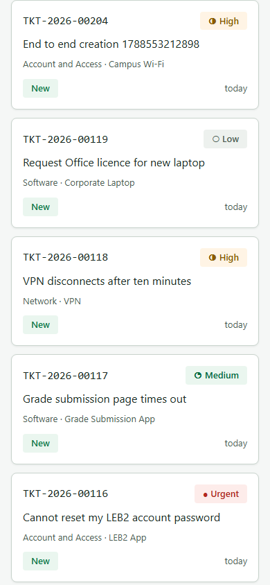

`artifacts/lab-02/screenshots/my-tickets/mobile-cards.png`

The mobile list renders **cards, not a table**. That is a difference in the DOM
rather than in styling: AC-40 asks for cards "rather than a table", and a table
hidden or scrolled by CSS is still a table in the accessibility tree. The
capture asserts **zero** `table` elements anywhere in the document, every card
at least 44px tall, and no horizontal page overflow. The tablet table drops
Related System only; every other column is retained.

### Completed visual checklist

`tests.md` §4, all 22 rows at all three widths. Rows marked **auto** are
enforced by a test that fails the build rather than by a human eye, and the test
is named; rows marked n/a do not apply at that width and say why rather than
being ticked vacuously.

| Requirement | How it is covered |
|---|---|
| **Colours** | STY-11 parses the token table out of `ui-spec.md` itself and fails on any colour in the stylesheet absent from it. The 15 distinct values are all present, and none of the D-09 KMUTT values appears in any file. |
| **Editable and read-only fields** | STY-03. Read-only controls carry the `readonly` attribute and the read-only background; editable ones do not. Read-only stays legible rather than greyed into illegibility. |
| **Disabled versus read-only** | STY-04. Disabled cannot take focus; read-only can. Two states, not one greyed appearance. |
| **Validation placement** | STY-01 and STY-02. Every required field carries a red asterisk, and each message is the next sibling of its own field and its `aria-describedby` target. |
| **Button hierarchy** | STY-06 asserts exactly one primary button per screen; STY-07 asserts no control relies on an icon alone. |
| **Clipping and overlap** | RSP-01 … RSP-03 at all three widths, plus the visual pass against the screenshots. |
| **Horizontal overflow** | RSP-01 … RSP-03 assert `scrollWidth - clientWidth <= 1` at every width. |

**One deliberate exception.** `/lab-01` carries no development notice and uses
Bootstrap colours outside the token table. A-05 excludes it from AC-44 and from
this checklist: wrapping the retained Lab 1 page in the Zen Green shell would
change the slice A-04 promises to preserve.

**Two limits worth stating.** jsdom loads no stylesheet, so the STY tests assert
the attribute and class contract the stylesheet keys off, plus the rules'
presence in source — what jsdom cannot see, that the rules paint, is covered by
the responsive suite and these screenshots. And there are no pixel-diff
baselines: they would fail on every intentional style change during a sprint
that changed styles constantly (`tests.md` §7).
